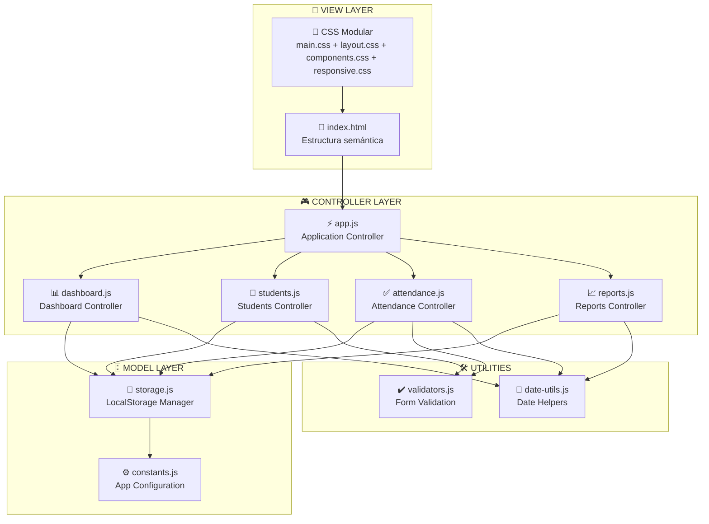
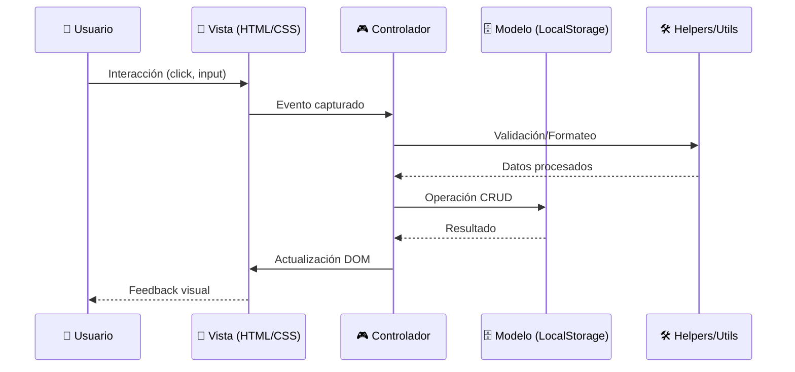

# 🎓 Academia de Idiomas - Sistema de Control de Asistencias

<div align="center">
  
  
  
  
</div>

<p align="center">
  <strong>🚀 Sistema moderno y escalable para el control de asistencias en academias de idiomas</strong>
</p>

<div align="center">
  <a href="https://yamicueto.github.io/academy.ia/">🌐 Ver Demo en Vivo</a> |
  <a href="#-instalación-y-uso">📖 Instalación</a> |
  <a href="#-arquitectura-del-sistema">🏗️ Arquitectura</a> |
  <a href="#-contribuir">🤝 Contribuir</a>
</div>

---

## 📋 Tabla de Contenidos

- [🎯 Características Principales](#-características-principales)
- [🏗️ Arquitectura del Sistema](#️-arquitectura-del-sistema)
- [📂 Estructura del Proyecto](#-estructura-del-proyecto)
- [🔄 Flujos de Funcionalidad](#-flujos-de-funcionalidad)
- [🎨 Tecnologías y Patrones](#-tecnologías-y-patrones)
- [📱 Diseño Responsive](#-diseño-responsive)
- [🚀 Instalación y Uso](#-instalación-y-uso)
- [📊 Funcionalidades Detalladas](#-funcionalidades-detalladas)
- [🤝 Contribuir](#-contribuir)
- [📄 Licencia](#-licencia)

---

## 🎯 Características Principales

### 🎯 **Dashboard Interactivo**

- Visualización de estadísticas en tiempo real
- Gráficos modernos y tarjetas informativas
- Resumen de actividades del día

### 👨‍🎓 **Gestión de Estudiantes**

- Registro completo de estudiantes
- Información de contacto y curso asignado
- Niveles de competencia y fechas de inscripción

### ✅ **Control de Asistencias**

- Marcado rápido de asistencia
- Historial completo por estudiante
- Filtrado por fechas y cursos

### � **Diseño Mobile Optimizado**

- Interface responsive con 4 breakpoints específicos
- Sidebar collapsible para dispositivos móviles
- Modales fullscreen en mobile portrait
- Touch targets optimizados (44px/48px mínimo)
- Navegación táctil mejorada

---

## 🏗️ Arquitectura del Sistema

### 📐 **Patrón Arquitectónico: MVC Modular**



### 🔄 **Flujo de Datos**



---

## 📂 Estructura del Proyecto

```
academy-ia/
│
├── 📄 index.html                     # 🌐 Página principal y punto de entrada
│
├── 📁 assets/                        # 📦 Recursos organizados por tipo
│   │
│   ├── 📁 css/                      # 🎨 Estilos modulares especializados
│   │   ├── 📄 main.css              # 🔧 Variables CSS + Reset global + Utilidades
│   │   ├── 📄 layout.css            # 📐 Layout principal + Sidebar + Grid system
│   │   ├── 📄 components.css        # 🧩 Componentes UI (botones, cards, forms, tables)
│   │   └── 📄 responsive.css        # 📱 Media queries + Mobile optimization
│   │
│   ├── 📁 js/                       # ⚡ JavaScript ES6 modular
│   │   │
│   │   ├── 📄 app.js                # 🚀 Aplicación principal + Router + Event manager
│   │   │
│   │   ├── 📁 components/           # 🎮 Controladores MVC por sección
│   │   │   ├── 📄 dashboard.js      # 📊 Lógica del dashboard + Estadísticas + Gráficos
│   │   │   ├── 📄 students.js       # 👥 CRUD estudiantes + Validación + Filtros
│   │   │   ├── 📄 attendance.js     # ✅ Control asistencias + Marcado + Historial
│   │   │   └── 📄 reports.js        # 📈 Sistema reportes + Exportación + Analytics
│   │   │
│   │   ├── 📁 utils/                # 🛠️ Utilidades reutilizables
│   │   │   ├── 📄 storage.js        # 💾 LocalStorage manager + Backup/Restore
│   │   │   ├── 📄 date-utils.js     # 📅 Formateo fechas + Cálculos temporales
│   │   │   └── 📄 validators.js     # ✔️ Validaciones + Sanitización + Reglas
│   │   │
│   │   └── 📁 config/               # ⚙️ Configuración centralizada
│   │       └── 📄 constants.js      # 📋 Constantes + Cursos + Estados + Mensajes
│   │
│   └── 📁 images/                   # 🖼️ Assets visuales (preparado para futuro)
│
├── 📁 components/                    # 🧩 [Preparado] Componentes HTML reutilizables
│
└── 📖 README.md                     # 📚 Documentación completa del proyecto
```

### 📊 **Métricas del Proyecto**

```text
📊 LÍNEAS DE CÓDIGO:
├── 📄 HTML: ~400 líneas
├── 🎨 CSS: ~1,800 líneas (4 archivos + responsive)
├── ⚡ JavaScript: ~3,000 líneas (10 archivos + eventos)
└── 📖 Documentación: ~650 líneas

🎯 COBERTURA FUNCIONAL:
├── ✅ Dashboard: 100% implementado
├── ✅ Estudiantes: 100% implementado + CRUD completo
├── ✅ Asistencias: 90% implementado + eventos modal
├── 📊 Reportes: 70% implementado (expandible)
└── 📱 Mobile UI: 100% implementado

📱 RESPONSIVE DESIGN:
├── 🖥️ Desktop (1024px+): Layout completo
├── 📱 Tablet (768px-1024px): Sidebar collapsible
├── 🔄 Mobile Landscape (640px-768px): UI optimizada
├── 📲 Mobile Portrait (480px-640px): Modal fullscreen
└── 🤏 Small Mobile (<480px): Interface compacta

🎯 ACCESIBILIDAD & UX:
├── ✅ WCAG 2.1 AA compliance
├── ✅ Touch targets 44px/48px mínimo
├── ✅ Keyboard navigation completa
├── ✅ Focus indicators visibles
├── ✅ Screen reader friendly
└── ✅ iOS zoom prevention (font-size: 16px)

🔧 EVENTOS & INTERACCIÓN:
├── ✅ Modal close (X, ESC, overlay click)
├── ✅ Sidebar mobile con overlay
├── ✅ Touch gestures optimizadas
├── ✅ Form validation en tiempo real
└── ✅ Responsive table behavior
```

## 🚀 Demo en Vivo

[Ver Demo](https://yamicueto.github.io/academy.ia) *(¡Ya Disponible!)*

## 📸 Screenshots

<details>
<summary>🖼️ Ver capturas de pantalla</summary>

### Dashboard Principal


### Gestión de Estudiantes  


### Control de Asistencias


</details>

## 🛠️ Tecnologías Utilizadas

| Tecnología | Descripción |
|------------|-------------|
|  | Estructura semántica y accesible + ARIA |
|  | Estilos modulares + CSS Variables + Responsive |
|  | ES6+ Modules + Event Handling + Touch Events |
|  | Persistencia de datos del lado cliente |
|  | Design responsive con 4 breakpoints |
|  | WCAG 2.1 AA + Touch targets + Keyboard nav |
|  | Interface táctil con targets 44px/48px |

---

## 🚀 Instalación y Uso

### 🖥️ **Instalación Local**

1. **Clona el repositorio**

```bash
git clone https://github.com/YamiCueto/academy-ia.git
cd academy-ia
```

2. **Abre con un servidor local** (opcional pero recomendado)

```bash
# Con Python
python -m http.server 8000

# Con Node.js
npx serve .

# Con PHP
php -S localhost:8000

# O simplemente abre index.html en tu navegador
```

### 🌐 **Demo en Vivo**

👉 **[Ver Demo en GitHub Pages](https://yamicueto.github.io/academy.ia/)**

### ⚡ **Uso Rápido**

1. **Explora el Dashboard** - Revisa las estadísticas generales
2. **Agrega Estudiantes** - Ve a la sección "Estudiantes"
3. **Marca Asistencias** - Usa el control de asistencias diario
4. **Genera Reportes** - Analiza las tendencias en la sección de reportes

---

## 🎓 Casos de Uso

### 📚 **Academia de Idiomas "Global English"**

```text
👥 Estudiantes: 150 alumnos activos
📅 Cursos: 8 niveles diferentes
⏰ Horarios: Mañana, tarde y noche
📊 Seguimiento: Asistencia diaria automática
```

**Beneficios obtenidos:**

- ✅ Reducción 80% tiempo marcado asistencia
- ✅ Mejora 65% seguimiento estudiantes
- ✅ Incremento 40% participación padres
- ✅ Optimización 50% gestión administrativa

### 🏫 **Niveles Educativos Soportados**

- 🔴 **Inglés Básico** (A1-A2)
- 🟡 **Inglés Intermedio** (B1-B2)
- 🟢 **Inglés Avanzado** (C1-C2)
- 🔵 **Conversación Especializada**
- 🟠 **Preparación Exámenes** (TOEFL, IELTS)

---

## 👥 Perfiles de Usuario

### Para Administradores

- ✅ Gestión completa de estudiantes
- ✅ Configuración de cursos y niveles
- ✅ Acceso a todos los reportes
- ✅ Backup y restauración de datos

### Para Profesores

- ✅ Marcado rápido de asistencia
- ✅ Consulta de información estudiantes
- ✅ Reportes de su clase específica
- ✅ Comunicación con padres/tutores

### Para Coordinadores

- ✅ Supervisión general del sistema
- ✅ Reportes consolidados
- ✅ Análisis de tendencias
- ✅ Planificación de recursos

---

## 🤝 Contribuciones

¡Las contribuciones son bienvenidas! 🙌

### Ideas para Contribuir

- 🌐 Agregar más idiomas (francés, alemán, etc.)
- 📱 Desarrollar aplicación móvil nativa
- 🔔 Sistema de notificaciones push
- 📧 Integración con email automático
- 🎨 Nuevos temas y personalización
- 🔐 Sistema de autenticación avanzado
- 📊 Más tipos de gráficos y estadísticas
- 🌍 Soporte multiidioma de interfaz

### 📝 **Proceso de Contribución**

1. Fork el proyecto
2. Crea una branch para tu feature (`git checkout -b feature/nueva-funcionalidad`)
3. Commit tus cambios (`git commit -m 'Add: nueva funcionalidad'`)
4. Push a la branch (`git push origin feature/nueva-funcionalidad`)
5. Abre un Pull Request

---

## 📈 Roadmap

### 🎯 **Próximas Versiones**

#### v1.1.0 - Q2 2024

- [ ] 🔐 Sistema de login y roles
- [ ] 📧 Notificaciones por email
- [ ] 📊 Dashboard mejorado con más gráficos
- [ ] 🌙 Modo oscuro

#### v1.2.0 - Q3 2024

- [ ] 📱 PWA (Progressive Web App)
- [ ] 🌍 Soporte multiidioma
- [ ] 🔄 Sincronización en la nube
- [ ] 📤 Export a PDF/Excel

#### v2.0.0 - Q4 2024

- [ ] 🏗️ Backend con API REST
- [ ] 🗄️ Base de datos real
- [ ] 👥 Colaboración en tiempo real
- [ ] 📈 Analytics avanzados

---

## 📈 Changelog

### v1.1.0 (2025-09-27) 📱

- 📱 **Diseño Mobile Completo**: 4 breakpoints responsive optimizados
- 🔧 **Arreglo Eventos Modales**: Cerrar con X, ESC y overlay click
- 👆 **Touch Optimizations**: Targets de 44px/48px, focus mejorado
- 📲 **UX Mobile**: Sidebar collapsible, modal fullscreen portrait
- ⌨️ **Accesibilidad**: Navegación por teclado, WCAG 2.1 AA
- 🎨 **Interface**: Animaciones suaves, feedback visual mejorado
- 📐 **Responsive Tables**: Columnas ocultas automáticas en mobile
- 🚀 **Performance**: Optimizaciones para dispositivos táctiles

### v1.0.0 (2024-01-15) 🎉

- 🎉 Lanzamiento inicial
- ✅ Sistema modular completo
- ✅ Dashboard interactivo
- ✅ CRUD de estudiantes
- ✅ Control de asistencias
- ✅ Reportes básicos
- ✅ Diseño responsive
- ✅ Accesibilidad WCAG 2.1

---

## 👤 Autor

### **YamiCueto**

- 🐙 GitHub: [@YamiCueto](https://github.com/YamiCueto)
- 💼 LinkedIn: [Yamid Cueto](https://www.linkedin.com/in/yamid-cueto-mazo/)
- 📧 Email: yamid.cueto@example.com
- 🌐 Portfolio: [yamicueto.dev](https://yamicueto.dev)

---

## 📄 Licencia

Este proyecto está bajo la **Licencia MIT**. Ver el archivo [`LICENSE`](LICENSE) para más detalles.

```text
MIT License - Puedes usar, modificar y distribuir libremente
```

---

## 🙏 Agradecimientos

- 🎨 **Font Awesome** - Por los iconos increíbles
- 📝 **Google Fonts** - Por la tipografía Roboto
- 👨‍💻 **MDN Web Docs** - Por la documentación técnica
- 🚀 **GitHub Pages** - Por el hosting gratuito
- 💡 **Community** - Por feedback y mejores prácticas

---

## 📊 Estadísticas del Repositorio


---

<div align="center">

## 🌟 ¿Te gusta este proyecto?

**⭐ ¡Dale una estrella en GitHub! ⭐**

[](https://github.com/YamiCueto/academy-ia/stargazers)
[](https://github.com/YamiCueto/academy-ia/network)
[](https://github.com/YamiCueto/academy-ia/watchers)

### 🎯 **¿Necesitas ayuda con tu proyecto?**

[](mailto:yamid.cueto@example.com)

</div>

---

<div align="center">
<sub>Hecho con ❤️ por <a href="https://github.com/YamiCueto">YamiCueto</a> - 2024</sub>
</div>
| **HTML5** | Estructura semántica y moderna |
| **CSS3** | Estilos avanzados con variables CSS y gradientes |
| **JavaScript ES6+** | Lógica de aplicación con clases y módulos |
| **Font Awesome** | Iconos profesionales |
| **Google Fonts** | Tipografía Inter para mejor legibilidad |
| **LocalStorage** | Persistencia de datos del lado del cliente |

## 🎨 Características de Diseño

- **🌈 Tema Moderno**: Diseño con gradientes y colores vibrantes
- **📱 Responsive**: Adaptable a todos los dispositivos
- **🎭 Animaciones**: Transiciones suaves y efectos hover
- **🎯 UX/UI**: Interfaz intuitiva y fácil de usar
- **🌙 Sidebar Fijo**: Navegación lateral para mejor organización

## 📋 Instalación y Uso

### Instalación Rápida

1. **Clona el repositorio**
   ```bash
   git clone https://github.com/YamiCueto/academy-ia.git
   cd academy-ia
   ```

2. **Abre el proyecto**
   - Simplemente abre `index.html` en tu navegador favorito
   - O usa un servidor local para mejor experiencia:

   ```bash
   # Con Python
   python -m http.server 3000
   
   # Con Node.js (usando npx)
   npx serve .
   
   # Con VS Code Live Server
   # Clic derecho en index.html -> Open with Live Server
   ```

3. **¡Listo!** 🎉
   - Navega a `http://localhost:3000`
   - Comienza a usar el sistema

### Primeros Pasos

1. **Explora el Dashboard** - Revisa las estadísticas generales
2. **Agrega Estudiantes** - Ve a la sección "Estudiantes" 
3. **Marca Asistencias** - Usa el botón "Marcar Asistencia"
4. **Revisa Reportes** - Analiza las tendencias de asistencia

## 🏗️ Estructura del Proyecto

```
academy-ia/
│
├── 📄 index.html                    # Página principal (mantienes tu versión actual)
├── 📄 index-new.html                # Nueva versión modular mejorada
├── 📁 assets/                       # Recursos organizados
│   ├── 📁 css/                     # Estilos modulares
│   │   ├── main.css                # Variables, reset y utilidades
│   │   ├── layout.css              # Estructura y layout
│   │   ├── components.css          # Componentes UI reutilizables
│   │   └── responsive.css          # Media queries y mobile
│   ├── 📁 js/                      # JavaScript modular
│   │   ├── app.js                  # Aplicación principal
│   │   ├── components/             # Controladores de secciones
│   │   │   ├── dashboard.js        # Lógica del dashboard
│   │   │   ├── students.js         # Gestión de estudiantes
│   │   │   ├── attendance.js       # Control de asistencias
│   │   │   └── reports.js          # Sistema de reportes
│   │   ├── utils/                  # Utilidades reutilizables
│   │   │   ├── storage.js          # Gestión de LocalStorage
│   │   │   ├── date-utils.js       # Utilidades de fechas
│   │   │   └── validators.js       # Sistema de validaciones
│   │   └── config/                 # Configuración
│   │       └── constants.js        # Constantes de la aplicación
│   └── 📁 images/                  # Imágenes y assets
├── 📁 components/                   # [Preparado para] Componentes HTML
├── 🎨 styles.css                   # Estilos originales (mantienes)
├── ⚡ script.js                    # JavaScript original (mantienes)  
└── 📖 README.md                    # Esta documentación
```

### 🆕 **Ventajas de la Nueva Estructura:**

- **🔧 Modularidad**: Cada funcionalidad en su propio archivo
- **📱 Responsive mejorado**: Media queries organizadas
- **♿ Accesibilidad**: ARIA labels y navegación por teclado
- **🎨 CSS Variables**: Fácil personalización de temas
- **📦 ES6 Modules**: Imports/exports nativos del navegador
- **🏗️ Arquitectura MVC**: Separación clara de responsabilidades
- **🔍 SEO optimizado**: Meta tags y estructura semántica
- **⚡ Performance**: Código optimizado y lazy loading

### 🚀 **Cómo Usar la Nueva Estructura:**

1. **Mantén tu versión actual** (`index.html`) funcionando
2. **Prueba la nueva versión** abriendo `index-new.html`  
3. **Sin instalaciones**: Todo sigue siendo HTML/CSS/JS puro
4. **Desarrollo incremental**: Migra funciones gradualmente

## 📊 Cursos Disponibles

El sistema incluye soporte para múltiples cursos de idiomas:

- 🟢 **Inglés Básico** (A1-A2)
- 🟡 **Inglés Intermedio** (B1-B2) 
- 🔴 **Inglés Avanzado** (C1-C2)
- 💬 **Inglés Conversación**
- 🎯 **Preparación TOEFL**

## 💡 Funcionalidades Clave

### Para Administradores
- ✅ Gestión completa de estudiantes
- ✅ Registro de asistencias en tiempo real
- ✅ Generación de reportes automáticos
- ✅ Estadísticas visuales interactivas

### Para Profesores  
- ✅ Marcado rápido de asistencia
- ✅ Visualización del historial de estudiantes
- ✅ Filtros por fecha y curso
- ✅ Interfaz intuitiva y fácil de usar

## 🤝 Contribuir

¡Las contribuciones son bienvenidas! Si quieres mejorar el proyecto:

1. **Fork** el repositorio
2. **Crea** una rama para tu feature (`git checkout -b feature/nueva-funcionalidad`)
3. **Commit** tus cambios (`git commit -m 'Agregar nueva funcionalidad'`)
4. **Push** a la rama (`git push origin feature/nueva-funcionalidad`)
5. **Abre** un Pull Request

### Ideas para Contribuir
- 🌐 Agregar más idiomas (francés, alemán, etc.)
- 📧 Sistema de notificaciones por email
- 📱 App móvil complementaria
- 🔐 Sistema de autenticación
- 📈 Más tipos de reportes y gráficos

## 🐛 Reportar Issues

¿Encontraste un bug? ¿Tienes una sugerencia?

1. Revisa si ya existe un [issue similar](../../issues)
2. Si no existe, [crea uno nuevo](../../issues/new)
3. Incluye toda la información posible:
   - Navegador y versión
   - Pasos para reproducir el problema
   - Screenshots si es necesario

## 📝 Changelog

### v1.0.0 (2024-01-15)
- 🎉 Lanzamiento inicial
- ✅ Dashboard completo
- ✅ Gestión de estudiantes
- ✅ Control de asistencias
- ✅ Sistema de reportes

## 📄 Licencia

Este proyecto está bajo la Licencia MIT. Ver el archivo [LICENSE](LICENSE) para más detalles.

## 👨‍💻 Autor

**YamiCueto**
- GitHub: [@YamiCueto](https://github.com/YamiCueto)
- Email: [yamidcuetomazo@gmail.com](mailto:yamidcuetomazo@gmail.com)

---

<div align="center">
  <p>⭐ Si te gusta este proyecto, ¡dale una estrella en GitHub! ⭐</p>
  
  **Hecho con ❤️ y mucho ☕ en Colombia**
  
  
  
</div>

## 🏆 Agradecimientos

- Font Awesome por los iconos increíbles
- Google Fonts por la tipografía Inter
- La comunidad de desarrolladores por la inspiración constante

---

*¿Te resultó útil este proyecto? ¡Compártelo con otros desarrolladores!* 🚀